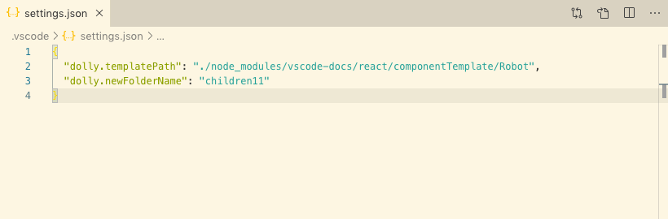

# Dolly

资源管理器中右键点击 “Dolly Go!”，会自动将模版 `/document/nullComponent` 复制到当前路径，命名为 `children`。

## 配置

模版路径和生成目录名称均可配置，方法如下：

### 方法一：通过 `/.vscode/settings.json`

### 方法二：通过 vscode 首选项/设置

打开首选项/设置，在“扩展”中找到 “Dolly Configuration”，修改对应配置

**Enjoy!**
